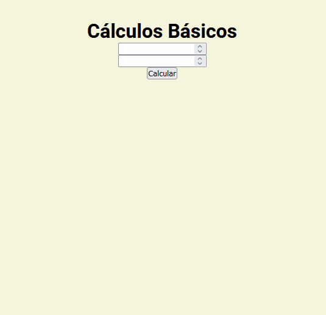

# Desafio JavaScript básicos

Desafio de JavaScript básico com operações matemáticas básicas, aproveitei para treinar alguns conceitos e ao invés de dar os resultados no console usei o próprio HTML para fazer esse retorno, também foram adicionadas funções de validações e foram fixadas o número de casas decimais nas divisões

## Link

[Site](https://martvie.github.io/desafio-javascript-basico/)

# Imagens Projeto

    

